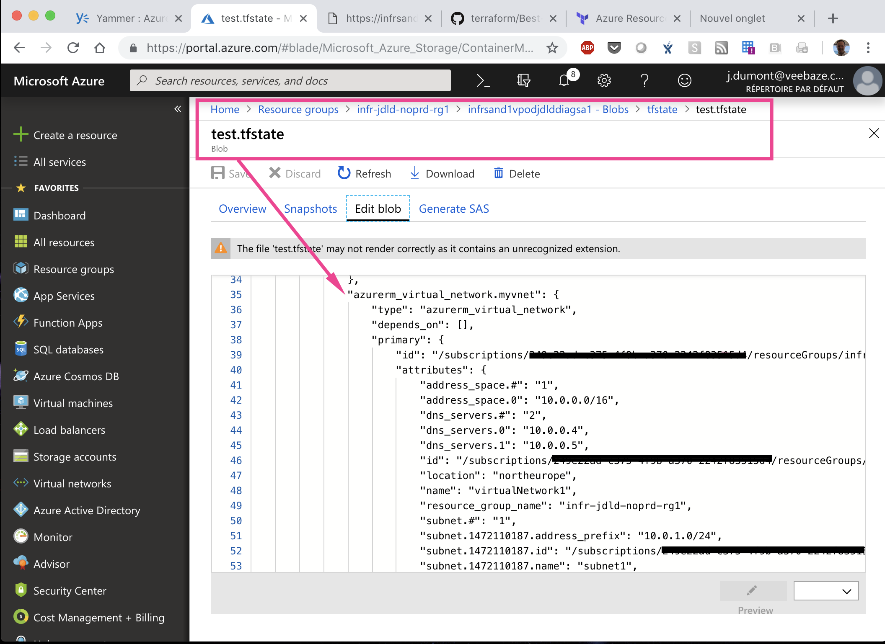
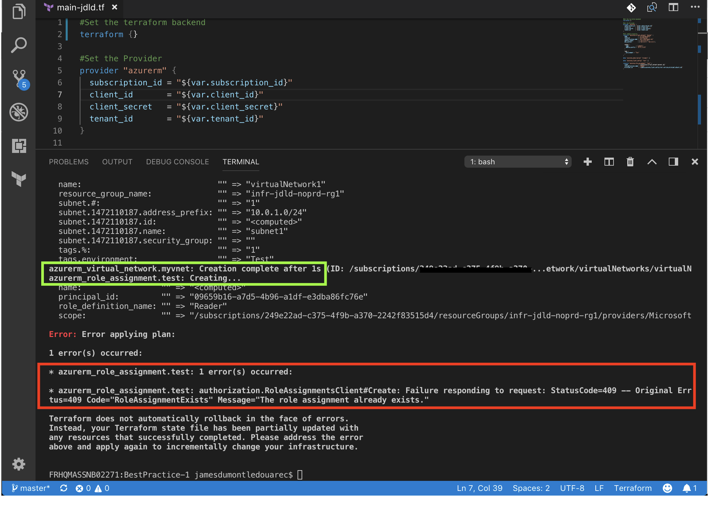

Best Practice 1
------------
Use remote backend.
In this article we will do the following action with a remote a backend and without a remote backend : 
1. Create a Virtual Network
2. Assign a Role Definition to the Virtual Network

The second step we will permit to demonstrate one of the reason why we should use a remote backend : some resources like "azurerm_role_assignment" couldn't update their tfstate if the "role assignment" is already done. [This article on GitHub](https://github.com/terraform-providers/terraform-provider-azurerm/issues/1857) describes this concern. 


What we should do
------------
We will create the upper mentioned element using remote backend.

In the following article our remote backend will be located on an Azure Storage Account and we will use a service principal to write on this storage account.
To do so we will have to declare the following bracelet in our Terraform tf file.
```hcl
terraform {
  backend "azurerm" {
    storage_account_name = "infrsand1vpodjdlddiagsa1"
    container_name       = "tfstate"
    key                  = "test.tfstate"
    resource_group_name  = "infr-jdld-noprd-rg1"
    arm_subscription_id  = "xxxxxxx-xxxx-xxxx-xxxx-xxxxxxxxxxxx"
    arm_client_id        = "xxxxxxx-xxxx-xxxx-xxxx-xxxxxxxxxxxx"
    arm_client_secret    = "xxxxxxx-xxxx-xxxx-xxxx-xxxxxxxxxxxx"
    arm_tenant_id        = "xxxxxxx-xxxx-xxxx-xxxx-xxxxxxxxxxxx"
  }
}
```


<h3>1. Usage</h3>
-----

    This step ensures that Terraform has all the prerequisites to build your template in Azure.

    ```hcl

    terraform init -backend-config="secret/backend-jdld.tfvars" -reconfigure

    ```
    The next step is to have Terraform review and validate the template. 
    This step compares the requested resources to the state information saved by Terraform and then outputs the planned execution. Resources are not created in Azure.
    ```hcl

    terraform plan -var-file="secret/main-jdld.tfvars"

    ```

    If all is ok with the proposal you can now apply the configuration.
    ```hcl

    terraform apply -var-file="secret/main-jdld.tfvars"

    ```

<h3>2. Analysis</h3>
-----

| Description | Screenshot |
| ------------- | ------------- |
| Our object have been created on Azure  |  |
| Our remote backend has generated a Terraform tfstate with all our objects specifications |  |


What we shouldn't do
------------
We will now omit the backend specification, this will imply that we will no longer depend on a remote backend, in other word we will not be aware of any other deployment that have already be done by another person.

We will demonstrate here that remote backend encourage collaboration.

Let's remove the following bracelet : backend "azurerm" {}.
The top part of our  script will look like the following : 
```hcl
terraform {
}
```

<h3>1. Usage</h3>
-----

    This step ensures that Terraform has all the prerequisites to build your template in Azure.

    ```hcl

    terraform init 

    ```
    > When the prompt `Do you want to copy existing state to the new backend?` appears enter `no` and press enter.


    You can now apply the configuration.
    ```hcl

    terraform apply -var-file="secret/main-jdld.tfvars"

    ```

<h3>2. Analysis</h3>
-----

| Description | Screenshot |
| ------------- | ------------- |
| Our object are still on Azure  |  |
| The Terraform fails because for some resource like "azurerm_role_assignment" we can’t automatically update our tfstate telling that the resource is already created as we wished. Note that it wasn’t the case for the resource "azurerm_virtual_network" |  |


See you!

Jamesdld