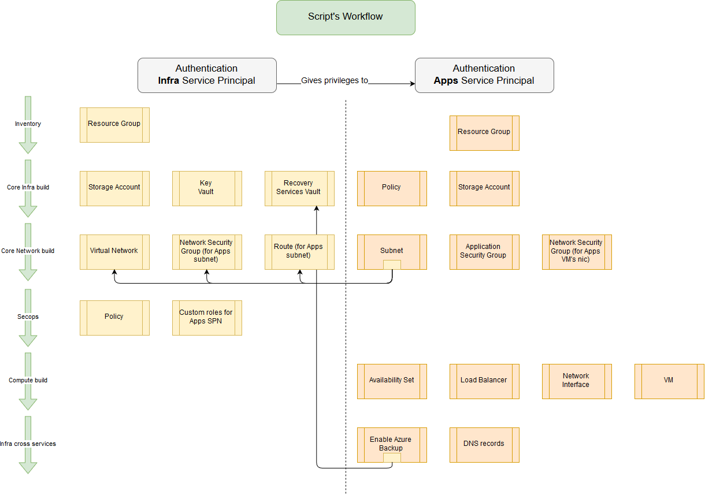

What's Terraform?
------------
Simple and Powerful

HashiCorp Terraform enables you to safely and predictably create, change, and improve infrastructure. It is an open source tool that codifies APIs into declarative configuration files that can be shared amongst team members, treated as code, edited, reviewed, and versioned.


Objective
------------
Share Terraform custom modules with the community with the following guidelines :
-	a module is dedicated to one action : create network interfaces, create an Azure recovery vault, ...
-	a module doesn't contain any static values
-	a module is called using variables

Workflow
------------


Usage
-----
The following sample will launch all the modules to show the reader how they are called.
My advice is that the reader pick up the module he wants and calls it how it's shown in the root "main.tf" file.

With your Terraform template created, the first step is to initialize Terraform. 
This step ensures that Terraform has all the prerequisites to build your template in Azure.

```hcl

terraform init -backend-config="backend-jdld-sand1.tfvars" -backend-config="secret/backend-jdld-sand1.tfvars"

```

The next step is to have Terraform review and validate the template. 
This step compares the requested resources to the state information saved by Terraform and then outputs the planned execution. Resources are not created in Azure.
```hcl

terraform plan -var-file="main-jdld-sand1.tfvars" -var-file="secret/main-jdld-sand1.tfvars"

```

If all is ok with the proposal you can now apply the configuration.
```hcl

terraform apply -var-file="main-jdld-sand1.tfvars" -var-file="secret/main-jdld-sand1.tfvars"

```

General Requirements
------------

-	[Terraform](https://www.Terraform.io/downloads.html) 0.10.x
-	[AzureRM Terraform Provider](https://github.com/Terraform-providers/Terraform-provider-azurerm/blob/master/README.md)
-	[AzureRM Terraform Provider - Authentication](https://www.Terraform.io/docs/providers/azurerm/)
-   An Azure Service Principal with the Owner privilege at Azure Subscription level (mandatory to create and assign custom roles)

Golden rules
------------
-	 Always use Terraform implicit dependency, evict the use of the depends_on argument, [see Terraform dependencies article for more info](https://www.terraform.io/intro/getting-started/dependencies.html)
-	 Use remote backends to save your Terraform state, [see Terraform remote backends article for more info](https://www.terraform.io/intro/getting-started/remote.html)

Improvment & Feature request & Limitation
------------
-	Terraform authentication to AzureRM via Service Principal & certificate
-   Use condition to decide wether or not a NIC should be linked to a Load Balancer, [ticket raised here](https://github.com/terraform-providers/terraform-provider-azurerm/issues/1318)
-   Feature Request: resource azurerm_automation_variable, [ticket raised here](https://github.com/terraform-providers/terraform-provider-azurerm/issues/1312)
-   Use multiple Azure service principal through the provider AzureRm, [ticket raised here](https://github.com/terraform-providers/terraform-provider-azurerm/issues/1308)
-	Currently there is no Terraform resource for AzureRm recovery services, that's why I used the Terraform resource azurerm_template_deployment. [Improvment has been requested here for info](https://github.com/Terraform-providers/Terraform-provider-azurerm/issues/1007)
    -	[Recovery Services provisionning is being studied here](https://github.com/terraform-providers/terraform-provider-azurerm/pull/995)
    -	[VM enrollment to a Recovery Service vault is being studied here](https://github.com/terraform-providers/terraform-provider-azurerm/pull/995)
-	Couldn't find any option to set the BackupStorageRedundancy paremeter (LRS or GRS) in the RecoveryServices/vaults template, [Microsoft.RecoveryServices/vaults template reference](https://docs.microsoft.com/en-us/azure/templates/microsoft.recoveryservices/vaults)